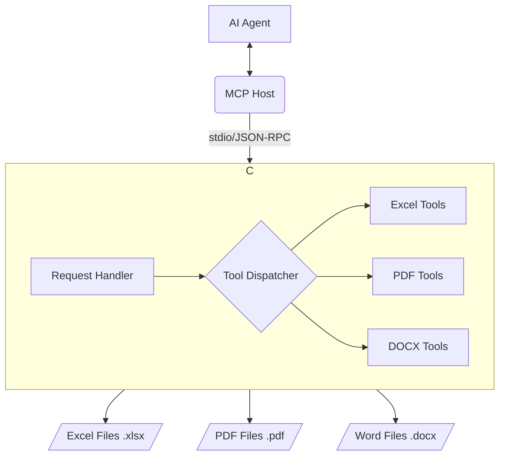

<div align="center">


# 🚀 Office Document Engine (ODE)
### **An MCP Server for Advanced Document Automation**


<h2 style="font-size:1.6rem; margin-top:12px;">Developed by Rayss</h2>


</div>

---

## 📖 Table of Contents

- [**1. Overview**](#-1-overview)
- [**2. Unleashing Automation: Key Features**](#-2-unleashing-automation-key-features)
- [**3. Architectural Foundation**](#-3-architectural-foundation)
- [**4. Getting Started**](#-4-getting-started)
- [**5. Interaction Methods**](#-5-interaction-methods)
- [**6. Comprehensive Tool Reference**](#-6-comprehensive-tool-reference)
  - [📊 **Excel Tools**](#-excel-tools)
    - [`excel_describe_sheets`](#excel_describe_sheets)
    - [`excel_read_sheet`](#excel_read_sheet)
    - [`excel_write_to_sheet`](#excel_write_to_sheet)
    - [`excel_copy_sheet`](#excel_copy_sheet)
    - [`excel_create_table`](#excel_create_table)
    - [`excel_format_range`](#excel_format_range)
    - [`excel_extract_images`](#excel_extract_images)
  - [📄 **PDF Tools**](#-pdf-tools)
    - [`pdf_read_text`](#pdf_read_text)
    - [`pdf_get_metadata`](#pdf_get_metadata)
    - [`pdf_search_text`](#pdf_search_text)
    - [`pdf_create_dummy`](#pdf_create_dummy)
    - [`pdf_extract_pages`](#pdf_extract_pages)
    - [`pdf_merge`](#pdf_merge)
    - [`pdf_split`](#pdf_split)
    - [`pdf_rotate_pages`](#pdf_rotate_pages)
  - [📝 **DOCX Tools**](#-docx-tools)
    - [`docx_read_text`](#docx_read_text)
    - [`docx_get_metadata`](#docx_get_metadata)
- [**7. Contributing**](#-7-contributing)
- [**8. License**](#-8-license)

---

## ✨ 1. Overview

The **Office Document Engine (ODE)** is more than just a tool; it's your gateway to next-level document automation. As a powerful, self-contained MCP (Model Context Protocol) server, ODE provides an unparalleled suite of capabilities for interacting with and manipulating common office documents. Imagine empowering your AI agents to seamlessly read, write, and modify Excel spreadsheets, PDF documents, and DOCX files programmatically. ODE unlocks a new realm of automated productivity, transforming tedious manual tasks into efficient, hands-free operations.

Whether you're looking to extract critical data from complex reports, dynamically generate tailored documents, or streamline your workflow with intelligent document processing, ODE offers the robust foundation you need. It's designed for developers and AI enthusiasts who demand precision, flexibility, and cutting-edge automation in their projects.

---

## 🚀 2. Unleashing Automation: Key Features

ODE stands out with its comprehensive and flexible feature set:

*   **Cross-Document Compatibility**: A unified interface to manage Excel, PDF, and DOCX files, eliminating the need for disparate tools.
*   **Intelligent Data Extraction**: Precisely read data from Excel sheets, extract text from PDFs and DOCX files, and retrieve valuable metadata.
*   **Dynamic Document Generation**: Create new Excel files, write data to specific cells, generate simple PDFs, and build DOCX content on the fly.
*   **Advanced Document Manipulation**: Merge, split, rotate PDF pages, copy Excel sheets, format cell ranges, and define structured tables within workbooks.
*   **Image Handling**: Extract embedded images from Excel files for further analysis or archiving.
*   **Seamless AI Integration**: Built on the Model Context Protocol (MCP), ODE is designed from the ground up to integrate effortlessly with AI agents, enabling sophisticated automated workflows.
*   **Robust Error Handling**: Clear error reporting and input validation ensure reliable execution and easier debugging for complex tasks.

---

## 🏗️ 3. Architectural Foundation

The ODE server operates as a dedicated, high-performance background process, ensuring minimal overhead and maximum responsiveness. Communication with your main AI agent is facilitated through the robust and efficient MCP `stdio` transport layer. This architecture guarantees secure, real-time data exchange and command execution, making ODE a seamless extension of your AI's capabilities.



The modular design of ODE ensures that each document type (Excel, PDF, DOCX) is handled by a specialized set of tools, allowing for focused development and easy expansion of functionalities. The central `Request Handler` intelligently dispatches incoming commands to the appropriate `Tool Dispatcher`, ensuring efficient processing and robust execution of every task.

---

## 🚀 4. Getting Started

Embark on your automation journey with ODE in a few simple steps:

### Prerequisites
Before you begin, ensure you have the following installed:
- **Node.js** (version 16.x or higher)
- **npm** (usually included with Node.js)

### Installation
Follow these commands to set up the ODE server:
```bash
# 1. Navigate into the server's directory
cd mcp-server

# 2. Install all dependencies
npm install

# 3. Compile the TypeScript project
npm run build
```

### MCP Configuration
To enable your AI environment to communicate with the ODE server, add the following configuration block to your `mcp_settings.json` file. This tells your MCP host how to find and interact with ODE.

> **Important:** The `args` path must be the correct **absolute path** to the compiled `index.js` file on your system.

```json
{
  "servers": {
    "office-document-engine": {
        "disabled": false,
        "timeout": 60,
        "command": "node",
        "args": [
            "<path-to-your-project>/mcp-server/build/index.js"
        ],
        "cwd": "<path-to-your-project>/mcp-server"
    }
  }
}
```
After adding the configuration, it is crucial to **restart your AI environment** to ensure the new server is properly loaded and recognized.

---

## 💻 5. Interaction Methods

The Office Document Engine is designed as a powerful **Model Context Protocol (MCP) server**. This means it primarily interacts with AI agents and other MCP-compatible hosts via the `stdio` transport layer, rather than functioning as a standalone command-line interface (CLI) tool for direct user execution.

To utilize ODE's rich set of document automation tools, you will typically integrate it with an MCP client or an AI environment that supports the MCP specification. Your MCP host will handle sending requests and receiving responses from ODE, allowing your AI to orchestrate complex document workflows seamlessly.

While ODE does not offer a traditional CLI for direct user commands, its modular design allows for potential future development of CLI wrappers or SDKs if the need arises for direct human interaction outside of an MCP environment.

---

## 🛠️ 6. Comprehensive Tool Reference

The Office Document Engine provides a rich set of tools, each meticulously designed to perform specific operations on Excel, PDF, and DOCX files. Below is a detailed breakdown of each tool, its purpose, input parameters, and typical use cases.

### 📊 Excel Tools

These powerful tools enable you to programmatically interact with Microsoft Excel workbooks, automating data management, analysis, and reporting.

1.  **`excel_describe_sheets`**
    *   **Description:** Gain immediate insight into the structure of any Excel workbook. This tool inspects the file and returns a comprehensive list of all sheets it contains, detailing their names and the active cell ranges within each. It's your first step to understanding complex spreadsheets.
    *   **Input:**
        *   `fileAbsolutePath` (string): The absolute path to the Excel file (e.g., `C:/path/to/financial_report.xlsx`).
    *   **Returns:** An object containing the file path and an array of sheet details (e.g., `{ file: string, sheets: Array<{ sheetName: string, range: string }> }`).
    *   **Example Use Case:** Before processing a new vendor's data, use this tool to discover the exact sheet names and data boundaries, ensuring your automation targets the correct information.

2.  **`excel_read_sheet`**
    *   **Description:** Extract data with precision from any Excel sheet. You can read the entire content of a sheet or specify a precise cell range (e.g., "A1:C10") to fetch only the data you need. This tool is invaluable for data ingestion and analysis workflows.
    *   **Input:**
        *   `fileAbsolutePath` (string): The absolute path to the Excel file.
        *   `sheetName` (string): The exact name of the sheet to read from (e.g., "SalesData", "Configuration").
        *   `range` (optional, string): A specific cell range (e.g., "B2:F15") to limit data extraction. If omitted, the entire sheet's used range is read.
        *   `showFormula` (optional, boolean): Set to `true` to retrieve cell formulas instead of their calculated values. Defaults to `false`.
        *   `showStyle` (optional, boolean): Set to `true` to include detailed cell style information in the output. Defaults to `false`.
    *   **Returns:** An object detailing the sheet, range, and a 2D array of the extracted data (e.g., `{ sheetName: string, range: string, rows: Array<Array<any>> }`).
    *   **Example Use Case:** Automatically pull weekly sales figures from a "Weekly Report" sheet, focusing only on the "Product" and "Revenue" columns (e.g., "A:B"), to feed into a dashboard.

3.  **`excel_write_to_sheet`**
    *   **Description:** Programmatically populate or update Excel sheets with new data. This versatile tool accepts a 2D array of data and writes it starting from a specified cell. It can also create new Excel files or new sheets within existing workbooks, making it perfect for dynamic report generation.
    *   **Input:**
        *   `fileAbsolutePath` (string): The absolute path to the target Excel file (e.g., `./new_data_entry.xlsx`).
        *   `sheetName` (string): The name of the sheet where data will be written.
        *   `newSheet` (optional, boolean): If `true`, a new sheet with `sheetName` will be created if it doesn't exist. Defaults to `false`.
        *   `range` (string): The top-left cell where the data writing will begin (e.g., "A1").
        *   `values` (array of arrays): A 2D array representing the data to be written (e.g., `[['Product', 'Quantity'], ['Laptop', 50], ['Mouse', 120]]`).
    *   **Returns:** An object confirming the write operation, including the file, sheet, range, and number of rows written (e.g., `{ file: string, sheetName: string, range: string, writtenRows: number }`).
    *   **Example Use Case:** After processing a batch of new orders, automatically write the order details and inventory updates to a "InventoryLog" sheet in your master inventory Excel file.

4.  **`excel_copy_sheet`**
    *   **Description:** Duplicate any sheet within an Excel workbook with ease. This is ideal for creating templates, backing up critical data, or preparing a new month's report based on the previous one, all without manual intervention.
    *   **Input:**
        *   `fileAbsolutePath` (string): The absolute path to the Excel file.
        *   `srcSheetName` (string): The name of the source sheet you wish to copy.
        *   `dstSheetName` (string): The desired name for the newly created duplicate sheet.
    *   **Returns:** An object confirming the copy operation (e.g., `{ file: string, srcSheetName: string, dstSheetName: string }`).
    *   **Example Use Case:** At the end of each fiscal quarter, create a copy of the "QTRLY_REPORT_TEMPLATE" sheet named "Q3_2024_REPORT" to begin drafting the new report.

5.  **`excel_create_table`**
    *   **Description:** Transform raw data ranges into structured Excel Tables. This tool defines a specified range of cells as a formal 'table' by creating a Named Range in the workbook. Excel Tables provide enhanced functionality for data analysis, filtering, sorting, and formula referencing, making your data more manageable and dynamic.
    *   **Input:**
        *   `fileAbsolutePath` (string): The absolute path to the Excel file.
        *   `sheetName` (string): The name of the sheet where the table will be created.
        *   `tableName` (string): A unique name to assign to the new table (e.g., "EmployeeDirectory", "ProjectTracker").
        *   `range` (optional, string): The cell range that will encompass the table (e.g., "A1:G50"). If omitted, the tool attempts to intelligently infer the data range.
    *   **Returns:** An object confirming the table creation, including the file, sheet, table name, and defined range (e.g., `{ file: string, sheetName: string, tableName: string, range: string, note: string }`).
    *   **Example Use Case:** Convert a raw list of customer contacts into a "CRM_Table" to easily filter by region or contact status using Excel's built-in table features.

6.  **`excel_format_range`**
    *   **Description:** Apply sophisticated cell styling programmatically to enhance the visual presentation of your Excel reports. This tool allows you to bold fonts, change background colors, apply borders, and more, across any specified cell range. Perfect for generating polished, professional-looking documents automatically.
    *   **Input:**
        *   `fileAbsolutePath` (string): The absolute path to the Excel file.
        *   `sheetName` (string): The name of the sheet to format.
        *   `range` (string): The precise cell range to apply formatting to (e.g., "A1:C1", "E5").
        *   `styles` (array of arrays of objects): A 2D array mirroring the `range`, where each object defines the styling for a corresponding cell (e.g., `[[{'font':{'bold':true, 'color':{'rgb':'FF0000'}}}]]` for a bold, red font).
    *   **Returns:** An object confirming the formatting operation.
    *   **Example Use Case:** Automatically highlight overdue invoices in a "Accounts Receivable" report by applying a red background to cells in the "Due Date" column that are past due.

7.  **`excel_extract_images`**
    *   **Description:** Locate and extract all embedded images from an Excel file, saving them to a specified output directory. This is useful for content auditing, archiving visual assets, or preparing images for use in other applications.
    *   **Input:**
        *   `fileAbsolutePath` (string): The absolute path to the Excel file.
        *   `outputDirectory` (string): The absolute path to the directory where the extracted images will be saved.
    *   **Returns:** An object confirming the extraction and listing the saved image paths.
    *   **Example Use Case:** Extract all product images from a "Product Catalog" Excel file to update an e-commerce website's image gallery.

### 📄 PDF Tools

These robust tools provide extensive capabilities for reading, manipulating, and generating PDF documents, enabling powerful automation for your digital paperwork.

> ### ⚠️ **Critical Incompatibility Note**
> The PDF tools within ODE utilize two distinct underlying libraries: `pdf-parse` for reading operations and `pdf-lib` for modification operations. It is crucial to understand that these libraries are **incompatible** with each other. Therefore, you should use reading tools **only** on external, standard PDF files that have not been modified by ODE's own modification tools. Attempting to read a PDF that was just created or altered by `pdf-lib` tools may lead to unexpected results or errors.

1.  **`pdf_read_text`**
    *   **Description:** Extract the complete textual content from any PDF file. This is an essential tool for content analysis, data mining, converting PDF content to searchable text, or preparing documents for summarization by other AI agents.
    *   **Input:**
        *   `fileAbsolutePath` (string): The absolute path to the PDF file (e.g., `C:/path/to/annual_report.pdf`).
        *   `pageNumbers` (optional, array of numbers): An array of 1-based page numbers (e.g., `[1, 5, 8]`) to limit text extraction to specific pages. If omitted, text from all pages is extracted.
    *   **Returns:** An object containing the file path, total pages, and the extracted text (e.g., `{ file: string, totalPages: number, text: string }`).
    *   **Example Use Case:** Automatically extract all clauses from a legal contract PDF to perform a compliance check or identify key terms.

2.  **`pdf_get_metadata`**
    *   **Description:** Retrieve vital metadata embedded within any PDF file. This includes information such as the author, creator application, creation date, modification date, and keywords. Understanding this metadata is crucial for document management, auditing, and content verification.
    *   **Input:**
        *   `fileAbsolutePath` (string): The absolute path to the PDF file.
    *   **Returns:** An object containing the file path and a detailed metadata object (e.g., `{ file: string, metadata: object }`).
    *   **Example Use Case:** Verify the author and creation date of a submitted proposal to ensure it meets submission guidelines and track its origin.

3.  **`pdf_search_text`**
    *   **Description:** Perform powerful text searches within PDF documents. This tool allows you to find specific keywords or phrases, with options for both case-sensitive and case-insensitive matching. It's perfect for quickly locating critical information across large PDF archives.
    *   **Input:**
        *   `fileAbsolutePath` (string): The absolute path to the PDF file.
        *   `searchText` (string): The exact text string or phrase to search for.
        *   `caseSensitive` (optional, boolean): If `true`, the search will differentiate between uppercase and lowercase letters. Defaults to `false` (case-insensitive).
    *   **Returns:** An array of objects, each indicating the page number and a list of matching text snippets found (e.g., `Array<{ page: number, matches: string[] }>`).
    *   **Example Use Case:** Find all mentions of "confidentiality agreement" across a collection of legal documents to review their usage and context.

4.  **`pdf_create_dummy`**
    *   **Description:** Rapidly generate new, simple PDF files with custom text content. This tool is exceptionally useful for testing purposes, creating placeholder documents during development, or programmatically generating basic one-page PDFs like receipts or confirmations on demand.
    *   **Input:**
        *   `fileAbsolutePath` (string): The absolute path where the new PDF will be saved (e.g., `./placeholder_document.pdf`).
        *   `textContent` (optional, string): The text string to be included in the PDF. If omitted, an empty PDF document is created.
    *   **Returns:** An object confirming the creation of the dummy PDF (e.g., `{ fileAbsolutePath: string, message: string }`).
    *   **Example Use Case:** Create a temporary PDF "Invoice #12345 - Pending" for a customer while the full invoice generation process completes.

5.  **`pdf_extract_pages`**
    *   **Description:** Precisely segment large PDF documents by extracting a specific subset of pages into a new, standalone PDF file. This is ideal for creating focused reports, sharing only relevant sections of a document, or reducing file sizes for easier distribution.
    *   **Input:**
        *   `fileAbsolutePath` (string): The absolute path to the source PDF file.
        *   `pages` (array of numbers): An array of 1-based page numbers (e.g., `[1, 3, 7-9]`) indicating the pages to be extracted. Ranges are supported.
        *   `outputFilePath` (string): The absolute path where the new PDF containing the extracted pages will be saved (e.g., `./summary_section.pdf`).
    *   **Returns:** An object confirming the successful extraction.
    *   **Example Use Case:** Generate a "Executive Summary" PDF containing only the first 5 pages of a 50-page quarterly business review.

6.  **`pdf_merge`**
    *   **Description:** Combine multiple separate PDF files into a single, cohesive document. This tool is indispensable for compiling various reports, appendices, or chapters into one master PDF, ensuring logical flow and simplified distribution. The order of files in the input array dictates their sequence in the merged document.
    *   **Input:**
        *   `fileAbsolutePaths` (array of strings): An array of absolute paths to the PDF files to be merged (e.g., `['./intro.pdf', './chapter1.pdf', './appendix.pdf']`).
        *   `outputFilePath` (string): The absolute path where the consolidated PDF will be saved (e.g., `./complete_manual.pdf`).
    *   **Returns:** An object confirming the successful merge operation.
    *   **Example Use Case:** Combine individual department reports into a single "Company Annual Report" PDF.

7.  **`pdf_split`**
    *   **Description:** Divide a single, larger PDF document into two distinct files at a specified page number. All pages preceding the `pageNumber` will form the first output file, and the remaining pages will constitute the second. This is perfect for breaking down large documents into manageable sections.
    *   **Input:**
        *   `fileAbsolutePath` (string): The absolute path to the PDF file to be split.
        *   `pageNumber` (number): The 1-based page number at which the document will be divided.
        *   `outputFilePathPart1` (string): The absolute path for the first segment of the split PDF.
        *   `outputFilePathPart2` (string): The absolute path for the second segment of the split PDF.
    *   **Returns:** An object confirming the successful split.
    *   **Example Use Case:** Separate a "Project Proposal" PDF into "Proposal_Main" and "Proposal_Appendix" at page 10.

8.  **`pdf_rotate_pages`**
    *   **Description:** Correct or adjust the orientation of specific pages within a PDF document by rotating them clockwise by 90, 180, or 270 degrees. This is invaluable for fixing incorrectly scanned documents, optimizing content for display, or preparing pages for specific print layouts.
    *   **Input:**
        *   `fileAbsolutePath` (string): The absolute path to the PDF file.
        *   `pages` (array of numbers): An array of 1-based page numbers to apply the rotation to.
        *   `rotationAngle` (number): The angle of rotation in degrees (must be 0, 90, 180, or 270).
        *   `outputFilePath` (string): The absolute path where the modified PDF will be saved.
    *   **Returns:** An object confirming the successful rotation.
    *   **Example Use Case:** Rotate a landscape-oriented chart page in a portrait PDF report by 90 degrees to make it readable without changing the entire document's orientation.

### 📝 DOCX Tools

These essential tools provide robust capabilities for interacting with Microsoft Word (.docx) documents, enabling automation of content extraction and metadata retrieval.

1.  **`docx_read_text`**
    *   **Description:** Extract the complete textual content from any Microsoft Word (.docx) document. This is a fundamental tool for content analysis, document summarization, legal review, or converting Word document content into a plain text format for further processing by AI agents.
    *   **Input:**
        *   `fileAbsolutePath` (string): The absolute path to the DOCX file (e.g., `C:/path/to/contract_draft.docx`).
    *   **Returns:** An object containing the file path and the extracted text (e.g., `{ file: string, text: string }`).
    *   **Example Use Case:** Automatically extract the full narrative from a policy document to identify and flag specific compliance keywords.

2.  **`docx_get_metadata`**
    *   **Description:** Retrieve critical metadata embedded within a .docx file. This includes valuable information such as the document's author, creation date, last modification date, revision count, and other custom properties. This metadata is vital for document governance, version control, and understanding document provenance.
    *   **Input:**
        *   `fileAbsolutePath` (string): The absolute path to the DOCX file.
    *   **Returns:** An object containing the file path and a detailed metadata object (e.g., `{ file: string, title: string, subject: string, creator: string, ... }`).
    *   **Example Use Case:** Before publishing a document, automatically check its metadata to confirm the correct author and ensure it has gone through the required number of revisions.

---

## 🤝 7. Contributing

We welcome contributions to the Office Document Engine! If you have ideas for new features, improvements, or bug fixes, please feel free to:

*   **Fork the repository**: Start by creating your own fork.
*   **Create a new branch**: Work on your changes in a dedicated branch.
*   **Submit a Pull Request**: Detail your changes and their benefits.

Please ensure your code adheres to the existing style and conventions. For major changes, please open an issue first to discuss what you would like to change.

---

## ⚖️ 8. License
This project is licensed under the MIT License.
